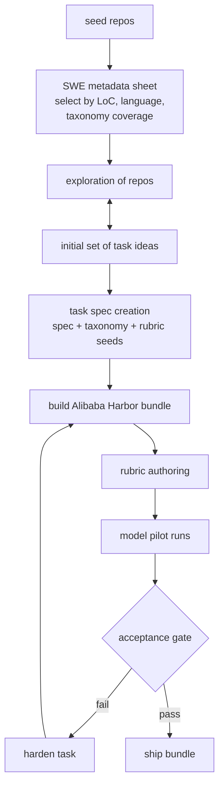

# Alibaba Coding Evals — Task Generation

This repo holds the skills and source data used to turn **seed repositories** into
**hard, original agent tasks** for the **Alibaba Coding Evals** benchmark in Harbor
format. It captures the end-to-end pipeline: pick repos, explore them, write specs,
build the Harbor bundle (query + env + exec verifier + rubrics + metadata), run model
pilots, score trajectories, and iterate until each task meets the acceptance bar.

The goal of every task is a **discriminative, hard** evaluation item: a ~100-LoC
multi-file gold patch, deterministic offline `fail2pass` + `pass2pass` exec verifier,
packaged `workspace.tar.gz` environment, rubrics aligned with the verifier, and
model trajectories that expose weaknesses relative to GLM and Claude.

## Acceptance criteria (Alibaba)

| Criterion | Target |
|-----------|--------|
| claude-opus-4.6 pass rate | ≤ 60% |
| qwen-3.7-max vs opus gap | ≥ 20% |
| claude-sonnet-4.6 vs opus gap | ≥ 20% |
| Average agent turns | ≥ 20 |
| Failure mode | Task-hardness, not environment failures |
| Grading | Exec-based verifier only; rubric correctness must not conflict with verifier |
| Distribution | ≤ 100 tasks per `code_lang × task_type × application`; ≥ 5 per ★★★ combo |

Required model trajectories (5 attempts each): `claude-opus-4.6`, `claude-sonnet-4.6`,
`qwen-3.7-max`, `glm-5.1`. Subagents are required for final acceptance.

Reference docs: [`docs/alibaba/`](docs/alibaba/) · Requirements: [`Alibaba Coding Evals ask.md`](Alibaba%20Coding%20Evals%20ask.md)

## Workflow



Phases 1–3 and 5–7 are skill-driven. Phase 4 (Harbor build) and Phase 6 (eval runs)
use the skills in this repo; exact Harbor eval commands run on the client's eval harness.

---

### Phase 1 — Select seed repos  ·  skill: [`seed-repo-selection`](skills/seed-repo-selection/)

Start from the SWE metadata sheet
(`Turing SWEBench Public Dataset (Long-Range Tasks only, n=2551).xlsx`) and select
**distinct, high-quality repositories** to author *original* tasks from.

- Quality gates: ~100-LoC patch band, `f2p_count >= 3`, `stars >= 250`, offline-safe repo size.
- **Taxonomy coverage**: spread picks across `code_lang × task_type × application` (≤ 100 per combo).
- **Output:** `seed_repos.csv`

### Phase 2 — Explore repos & ideate task surfaces  ·  skill: [`seed-repo-exploration`](skills/seed-repo-exploration/)

Deep-readonly exploration per repo → `repo_summary.md` with mental model, offline
notes, and 8–14 file-cited "Good Surfaces for Original Tasks".

Consider Alibaba high-priority dimensions when surfacing ideas (long-horizon, subagents,
web search, multi-turn user, claude.md compliance, etc.).

**Output:** `tasks/<repo-slug>/repo_summary.md`

### Phase 3 — Write the task spec  ·  skill: [`task-spec-creation`](skills/task-spec-creation/)

One `task_spec.md` per repo — the contract for Harbor build + rubric authoring.

Includes: taxonomy tags, Alibaba meta (one-sentence description, why worth evaluating,
author self-assessment), rubric seeds (correctness points mirroring the future verifier),
and high-priority dimension flags.

**Output:** `tasks/<repo-slug>/task_spec.md`

### Phase 4 — Build the Alibaba Harbor bundle  ·  skill: [`alibaba-harbor-task-build`](skills/alibaba-harbor-task-build/)

Convert each spec into a complete ship bundle:

```
deliverables/<slug>/
  test/<slug>.json
  test-assets/<slug>/
    instruction.md, task.toml, environment/, tests/, solution/
    rubric.md, metadata/, runs/, scoring/
```

- **Query:** `test/<slug>.json` with `description` == `instruction.md`
- **Env:** `environment/workspace.tar.gz` + Dockerfile (no git-fetch at grade time)
- **Verifier:** exec-based `tests/test.sh` with embedded fail2pass patch; writes `0/1` reward
- **Ground truth:** `solution/solve.sh` with embedded gold patch
- **No LLM judges** — grading is deterministic exec only

**Output:** one bundle per repo under `deliverables/`

### Phase 5 — Rubric authoring  ·  skill: [`alibaba-rubric-authoring`](skills/alibaba-rubric-authoring/)

Generate or refine `rubric.md` from the overall rubric spec + per-task criteria.
**Hard gate:** correctness rubric items must be logically equivalent to the exec verifier
(no extra requirements, no weaker bar).

**Output:** finalized `rubric.md` + `scoring/scoring_summary.json` scaffold

### Phase 6 — Model pilot runs & scoring  ·  skill: [`alibaba-eval-acceptance`](skills/alibaba-eval-acceptance/)

Run the fixed agent setup (claudecode + subagents, same tools for all models) at
5 attempts per required model. Record trajectories, turn counts, pass/fail, and tag
environment failures separately from task-hardness failures.

Dual-reviewer rubric scoring → `scoring/scoring_summary.json` with agreement score.

**Output:** `runs/model_runs.json`, updated scoring summary

### Phase 7 — Acceptance gate & hardening  ·  *iterate ×N*

Check all acceptance criteria. If the task is too easy, too hard (env failures), or
poorly discriminating, harden via spec/build changes and re-run pilots.

Human QA on verifier quality (gold passes, plausible-wrong fails) and instruction clarity.

---

## Repository contents

| Path | What it is |
|------|------------|
| `docs/alibaba/` | Reference Harbor case, sample task, rubrics, taxonomy |
| `skills/seed-repo-selection/` | Select & rank seed repos from metadata sheet |
| `skills/seed-repo-exploration/` | Deep-explore repos into `repo_summary.md` |
| `skills/task-spec-creation/` | Write `task_spec.md` with taxonomy + rubric seeds |
| `skills/alibaba-harbor-task-build/` | Build full Alibaba Harbor bundle from spec |
| `skills/alibaba-rubric-authoring/` | Author rubrics aligned with exec verifier |
| `skills/alibaba-eval-acceptance/` | Model pilots, scoring, acceptance checklist |
| `Alibaba Coding Evals ask.md` | Full requirements and rubric spec |
| `Turing SWEBench Public Dataset (...).xlsx` | Source metadata for Phase 1 |

Run skills in order: **selection → exploration → spec → Harbor build → rubric → eval → acceptance**.
