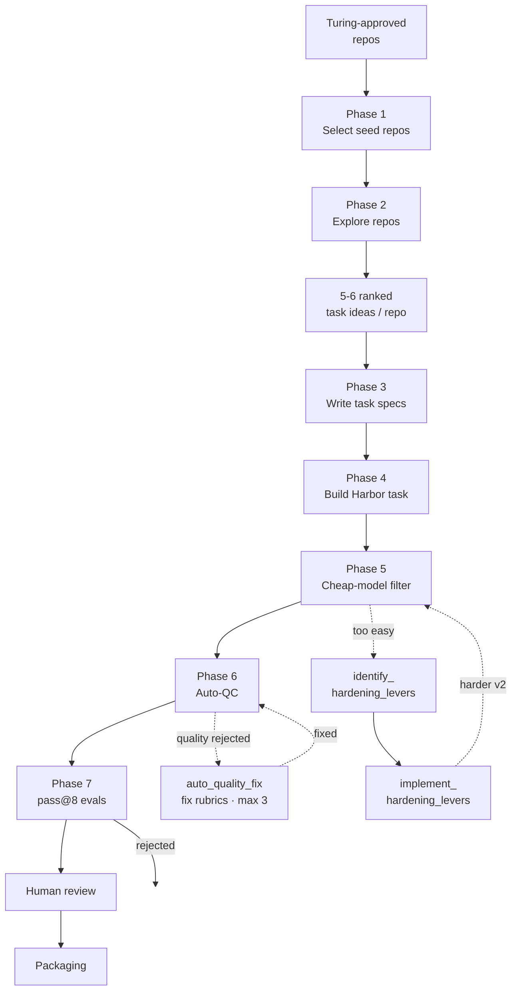

# SWE Task Generation

This repo holds the skills, source data, and QC tooling used to turn **Reflection-approved
seed repositories** into **hard, original SWE agent tasks** in Harbor (SWE-Bench-style)
format. It captures the end-to-end pipeline: pick an approved repo, build a deep mental
model of it, ideate a ranked set of hard task surfaces, write specs for the top 3, build
a Harbor task per spec, then filter/QC/eval each until it is genuinely hard, fair, and
shippable.

Every task is a **strictly net-new** feature/capability or real edge-case gap — an
original problem authored from the repo that is **genuinely absent at the pinned base
SHA** (never derived from an existing PR/commit/issue, and never a seeded regression).
Each ships a **multi-file gold patch sized to the provided task requirements** (e.g. a
minimum gold-patch LoC and/or a minimum number of non-test files touched), a
**comprehensive deterministic offline `fail2pass` suite (>5 F2P tests, min 5)** with the
repo's existing suite as the `pass2pass` regression guard, and a `<100 MB` git image with
an offline Docker build.

> The LoC band, F2P count, net-new cap, and difficulty gate come from the **batch
> task-requirements file** for the current batch (e.g. `docs/<client>_task_requirements.md`);
> the numbers here are **defaults** used when none is supplied. A hard floor of **> 5 F2P
> tests** always applies regardless of the batch.

**Difficulty target (per the batch task-requirements file; default): ~50% Medium / ~50%
Hard**, measured as **pass@8** in the models' native harnesses:

- **Medium** — GPT-5.5 (Codex) or Opus 4.8 (Claude Code) solves `≤ 4/8`.
- **Hard** — GPT-5.5 (Codex) or Opus 4.8 (Claude Code) solves `≤ 2/8`.

## Two strict inputs (do not deviate)

1. **Repos:** author tasks **only** from the **Turing-approved subset** of the custom
   repositories list. The approved list is `docs/turing_approved_repos.txt` (the
   sign-off applied to `docs/[External] Turing __ ReflectionAi - Swebench custom -
   Repositories list.xlsx`). This is a **hard gate** — a repo that is not on
   `turing_approved_repos.txt` must not be used, no exceptions.
2. **Task requirements:** every task must satisfy the **provided task requirements
   file** (currently `docs/updated_reflection_reqs_9_july.pdf`, `.docx` mirror
   alongside it). All difficulty bands, gold-patch LoC / non-test-file minimums, the
   F2P floor, taxonomy/labels, distribution targets, submission format, and quality
   rules come from that file — swap in a different requirements file and the tasks
   adhere to it instead.

---

## Before Phase 1 — run the pipeline with Claude Code

The phases below are driven by the skills in `skills/`. The cheapest way to run the
authoring phases (1–4) is **Claude Code CLI pointed at `z-ai/glm-5.2` via OpenRouter**.

1. Set the OpenRouter + model env vars (paste your OpenRouter key into
   `ANTHROPIC_AUTH_TOKEN`):

```bash
export ANTHROPIC_BASE_URL="https://openrouter.ai/api"
export ANTHROPIC_API_KEY=""
export ANTHROPIC_AUTH_TOKEN="your-sk-or-openrouter-key-here"

export ANTHROPIC_MODEL="z-ai/glm-5.2"
export ANTHROPIC_DEFAULT_SONNET_MODEL="z-ai/glm-5.2"
export ANTHROPIC_DEFAULT_HAIKU_MODEL="z-ai/glm-5.2"
export CLAUDE_CODE_SUBAGENT_MODEL="z-ai/glm-5.2"
```

That is all the configuration needed.

2. Start Claude Code in the terminal (from this repo root):

```bash
claude
```

3. Prompt Claude to use the skills and start the phases, e.g.:

> Use the skills in `skills/` to run the SWE task-generation pipeline. Start at Phase 1
> (`seed-repo-selection`), using **only** repos from `docs/turing_approved_repos.txt`
> and the requirements in `docs/updated_reflection_reqs_9_july.pdf`, then continue
> through exploration → spec → Harbor build.

Claude will invoke `seed-repo-selection` → `seed-repo-exploration` → `task-spec-creation`
→ `task_spec_to_harbor_task` in order. The difficulty filter (Phase 5), Auto QC
(Phase 6), and full pass@8 evals (Phase 7) are separate steps run with their own
tooling/harnesses described below.

---

## Workflow



Phases 1–4 are automated by the skills in this repo. Phase 5 is a cheap pre-filter, Phase
6 is the automated Auto-QC (ARIA) pass, and Phase 7 is the final pass@8 benchmark that
fills the `pass_at_k_*` metadata. When Phase 5 flags a task as too easy, the hardening
loop (`identify_hardening_levers` → `implement_hardening_levers`) diagnoses why and rebuilds
a harder version that re-enters at Phase 5. Phase-7 rejects leave the pipeline; accepted
tasks go to **human review** and then **packaging**.

---

### Phase 1 — Select seed repos  ·  skill: [`seed-repo-selection`](skills/seed-repo-selection/)

Author *original* tasks **only** from Turing-approved repos. Start from the metadata
sheet (`docs/Turing SWEBench Public Dataset (Long-Range Tasks only, n=2551).xlsx`) for
per-repo signals, but **restrict the candidate set to `docs/turing_approved_repos.txt`** —
never select a repo that is not on that list.

> **Optional task requirements.** Phase 1 (and Phase 2) can also be handed a *task
> requirements* file describing what kind of net-new tasks this batch should target —
> e.g. a gold-patch size band (`>500 LoC`, `>1k LoC`), a minimum number of non-test
> files touched (`>3`), a specific language distribution, or a category/domain focus.
> When provided, **translate those criteria into the selection thresholds**
> (`--min-instance-loc` / `--target-instance-loc`, `--lang-counts`, and a preference for
> larger / multi-module repos) so only repos that can plausibly support the requested
> tasks are shortlisted. The same requirements then steer the 5–6 difficult task ideas
> produced in Phase 2.

The skill (`skills/seed-repo-selection/scripts/select_seed_repos.py`) filters and ranks
against `updated_reflection_reqs_9_july` and writes a deduped CSV (one row per repo):

- **Metadata used:** per-task patch size (`instance_loc`), total repo size (`loc`),
  `language`, `difficulty_score`, `code_type_primary` (feature / bug-fix / refactor),
  `f2p_count` / `p2p_count`, `stars`.
- **Approved-repo gate (hard):** `--approved-repos docs/turing_approved_repos.txt` is
  applied **before anything else** — a repo that is not on the approved list is never
  selectable (drop the flag only if no approved list exists yet).
- **Quality gate** (all tunable): `instance_loc` in the target band (default ~350-LoC,
  ≈150–800; set per the task spec), `f2p_count >= 5` (a signal the repo has dense tests),
  `stars >= 250` (≥40% of tasks must come from >1k-star repos), and sane repo size (drops
  the unknown/huge sentinel to keep the image `<100 MB`).
- **Ranking signals (soft):** closeness to the `instance_loc` sweet spot, higher
  `difficulty_score`, capped popularity, and test coverage. `code_type_primary`
  (feature / bug-fix / refactor) is only a *suggestion* here — a bug-fix scoring bonus,
  **not** a hard filter.
- **Coverage:** pick N repos per language group; the global language distribution and the
  diversity caps (no repo `>10%`, no owner `>20%`, ≥8 languages, no language `>30%`) are
  reconciled batch-wise later.

**Output:** `seed_repos.csv` — candidate approved repos that feed exploration.

### Phase 2 — Explore repos & ideate task surfaces  ·  skill: [`seed-repo-exploration`](skills/seed-repo-exploration/)

For each selected repo, shallow-clone it and run one **read-only exploration subagent**
(in parallel batches) that returns a dense `repo_summary.md`. The summary is
task-authoring intelligence, not docs:

- overview, build/test/tooling, architecture, and a real **mental model** (type
  hierarchy, module graph, end-to-end pipeline) — every claim cites a real file path;
- **Testing** + **Offline / Containerization Notes** — which test layers are
  offline-safe (unit) vs need network/display/GPU/live services (the offline gate);
- **"Difficult Task Ideas"** — **5–6 file-cited ideas, ranked hardest-first**, that are
  genuinely hard *and* realistic/fair (work engineers actually build and use — not
  contrived puzzles). Each names the implementation file(s) + the test file(s) that would
  anchor fail2pass, a **multi-file** change sketch (sized per the task spec), a one-line
  **why it's hard** + a rough **difficulty target** (Hard ≤2/8 or Medium ≤4/8), the
  **type of task idea** (feature, bug-fix, performance optimization, ML engineering, data
  auditing, algorithm implementation, LLM pipeline, …), a likely taxonomy **category** +
  **source type**, and offline-safe vs not.

This is the **exploration ⇄ initial task ideas** loop: the ranked "Difficult Task Ideas"
section *is* the candidate pool that Phase 3 selects the top 3 hardest from, so thin
summaries (or ones without 5–6 ranked, genuinely-hard, realistic ideas) are re-explored.

**Output:** `tasks/<repo-slug>/repo_summary.md` per repo.

### Phase 3 — Write the task specs  ·  skill: [`task-spec-creation`](skills/task-spec-creation/)

Turn each explored repo into **up to three** task specs — `task_spec_1.md`,
`task_spec_2.md`, `task_spec_3.md` (#1 = hardest) — by **selecting the top 3 most
difficult ideas** from that repo's ranked 5–6 "Difficult Task Ideas". Each spec is one
distinct, deliberately **hard, original** task and the contract its Harbor build is
written against.

- **Rank & select the top 3** of the repo's 5–6 candidate ideas by genuine difficulty,
  confirming each against the actual cloned source. One idea → one spec; never merge or
  chain ideas. If fewer than 3 are viable/buildable, write only the viable ones and note
  why.
- **Prove it's net-new** against the pinned base SHA: `source_type = net-new` always —
  grep/read the source to confirm the capability (or the specific edge/variant) is
  **genuinely absent** at baseline, so the gold patch adds it. Never derive a task from
  an existing PR/commit/issue, and never seed a regression.
- **Confirm buildability** per spec: a multi-file gold patch sized to the task
  requirements (min LoC / min non-test files) is feasible, there's an exact correctness
  oracle, and a comprehensive deterministic offline **>5 F2P (min 5)** suite can be
  written (the repo's existing suite is the `pass2pass` guard).
- **Assign taxonomy:** category/subcategory + objective/artifact labels, aiming for
  uniform, diverse coverage across categories (and languages) at the batch level.
- **Don't leak:** the problem-statement draft describes behavior only — no file lists, no
  test names, no implementation steps, no root-cause/fix hints.

The skill ships a `difficulty_playbook.md` (levers + ranked "hard archetypes" + a
self-test), a `task_taxonomy.md`, and a `task_spec_template.md` for the exact output
shape.

**Output:** `tasks/<repo-slug>/task_spec_{1,2,3}.md` per repo (alongside
`repo_summary.md`), hardest-first.

### Phase 4 — Build the tasks in Harbor format  ·  skill: [`task_spec_to_harbor_task`](skills/task_spec_to_harbor_task/)

Implement **each** `task_spec_N.md` as its own complete, runnable Harbor task (point the
skill at each spec separately). The instruction must **not** leak the verifier. Layout
(matching the Reflection submission format):

- `instruction.md` — behavior-focused, slightly underspecified problem statement;
- `task.toml` — config + full `[metadata]` (repo, base_commit, `source_type`,
  difficulty + explanation, category/subcategory, objective/artifact labels,
  `num_f2p_tests`, and `pass_at_k_*` filled after eval);
- `environment/` — `Dockerfile` (pins the base SHA, installs deps at build time, bakes a
  pristine `/opt/baseline`) + `problem_statement.md`;
- `solution/` — `golden.patch` (source-only, multi-file, sized to the task
  requirements' min LoC / non-test-file targets) + `solve.sh`;
- `tests/` — `test.sh` embedding the hidden **new F2P test patch inline**, restoring
  pristine tests, then running the new F2P + a relevant existing pass2pass subset offline
  and writing a `0`/`1` reward.

Grading is a single **deterministic** offline test run (no LLM judge). Verify with the
skill's `scripts/verify.sh` that both patches apply at the base SHA, source/test are
cleanly separated, and the instruction leaks nothing.

**Output:** one Harbor task folder per spec (up to 3 per repo).

### Phase 5 — Cheap-model difficulty pre-filter  ·  cheap-model pass@1 (default GLM-5.2, Claude Code)

Before spending on the full pass@8 benchmark, cheaply screen out tasks that aren't
actually hard. Run a **single attempt (pass@1)** of the built task through the **Harbor
eval harness with the Claude Code agent on a cheaper model** — default **GLM-5.2** (chosen
for being much cheaper than a frontier model while close to Opus 4.8 in performance; the
batch task-requirements file may name a different cheap model).

- If **the cheap model solves the task** (reward = 1), it is **not difficult** — such a
  task will almost certainly be solved by the frontier target models, so **harden it** with
  the hardening loop (see below) — `identify_hardening_levers` → `implement_hardening_levers` — or drop it.
- If **the cheap model fails**, the task survives to Auto QC and the full pass@8 benchmark.

This mirrors the guidance to use a cheaper model for an initial difficulty assessment
before the expensive frontier-model runs. Save the pass@1 results
(`.jsonl`/`.json`/per-task dir) — Phase 6's Auto-QC folds them in as a difficulty signal
via `--prefilter`, and the hardening skill reads them (plus the trajectory) to diagnose
*why* a task was easy.

### Phase 6 — Auto QC  ·  skill: [`auto-qc`](skills/auto-qc/)

Gate each surviving Harbor task **accept/reject** with the `auto-qc` skill, which
combines two signals into one verdict:

1. **Quality (primary gate, two LLM judges)** — the vendored **ARIA-for-Harbor** pipeline
   is run by **two independent judges** — **Opus 4.8** (`anthropic:claude-opus-4-8`, via the
   Anthropic API) and **Kimi K2.7 Code** (`openrouter:moonshotai/kimi-k2.7-code`, via
   OpenRouter) — each scoring the task on nine quality rubrics: `issue_clarity`,
   `gold_patch_clarity`, `gold_patch_to_issue_alignment`, `test_clarity`,
   `test_to_issue_alignment`, `fairness`, `instruction_leakage`, `test_false_negatives`
   (tests wrongly reject valid solutions), and `test_false_positives` (tests wrongly accept
   invalid/gamed solutions). A judge **accepts** iff none of `issue_clarity` /
   `test_to_issue_alignment` / `test_false_negatives` / `test_false_positives` / `fairness`
   is ≥ 2, at most 2 of those four test/fairness rubrics score 1, and `instruction_leakage`
   is within that judge's tolerance — **asymmetric**: the stricter judge (opus) tolerates a
   minor leak (`≤ 1`) while the lenient judge (kimi) must be leak-free (`= 0`); a significant
   leak (`≥ 2`) rejects for either. The judges are merged into one verdict; by default
   (`--judge-agreement all`) a task is rejected if **either** judge fails a gate (use `any`
   to accept if either accepts).
2. **Difficulty (modulates an accepted task)** — the optional Phase 5 cheap-model
   pass@1 results, passed via `--prefilter`. A task the cheap model already solves is
   flagged `difficulty_concern` (or rejected under `--strict-difficulty`).

The skill drives everything through the orchestrator at `scripts/auto_qc/auto_qc.py`
(which runs `uv run annotate-one --model <judge>` inside `ARIA-FOR-HARBOR/` once per judge
per task):

```bash
# one-time: sync the ARIA env + set BOTH judge provider keys
cd scripts/auto_qc/ARIA-FOR-HARBOR && uv sync   # + export ANTHROPIC_API_KEY and OPENROUTER_API_KEY (or .env)

cd scripts/auto_qc

# QC one task (two default judges: opus + kimi)
python auto_qc.py <path>/harbor_tasks/<task-slug> --output-dir out

# QC a batch, folding in the Phase 5 cheap-model pass@1 pre-filter
python auto_qc.py <path>/harbor_tasks --prefilter <cheap_model_pass1.jsonl> --output-dir out

# strict difficulty gate: also reject anything the cheap model solved at pass@1
python auto_qc.py <path>/harbor_tasks --prefilter <results/> --strict-difficulty
```

Outputs land under `--output-dir`: a per-task `autoqc/<slug>.autoqc.json` (final verdict,
reasons, flags, merged rubric scores, and a per-judge `quality.judges` block with each
judge's own verdict + 9 rubric scores, difficulty signal), an `auto_qc_summary.{json,csv}`
table (merged columns plus per-judge `<name>_verdict/_score/_rubric_*` columns), and each
judge's raw ARIA annotation under `aria/<judge>/`. Note Auto-QC is an **LLM annotation** of
the instruction/patch/tests — it never runs the Docker verifier (that deterministic
build+apply+test check is `task_spec_to_harbor_task/scripts/verify.sh`) and is a screen,
not a substitute for human QA on borderline tasks. Only accepted tasks proceed to the
final benchmark. See `skills/auto-qc/SKILL.md` and `scripts/auto_qc/README.md` for detail.

**Quality-fix loop  ·  skill: [`auto_quality_fix`](skills/auto_quality_fix/).** When
Auto-QC **rejects** a task on quality, this skill repairs it to an accept. It reads the
`autoqc/<slug>.autoqc.json` failing gates (and optionally the Phase-5/7 eval evidence),
first **triages fixability** — a structurally-invalid or intrinsically-unfair task is
flagged up front with the reason + a human-fix/reject recommendation and *not* looped
(saving QC cost) — then applies targeted, **requirement-preserving** fixes to the flagged
rubrics (per `rubric_fix_playbook.md`), re-runs Auto-QC, and loops until accepted, **capped
at 3 iterations** (stop early on accept). A pure `difficulty_concern` flag is not a quality
problem — that goes to the hardening loop, not here.

### Phase 7 — Final pass@8 benchmark  ·  Opus 4.8 (Claude Code) + GPT-5.5 (Codex) via Daytona

Establish and record the official difficulty by running **pass@8** in each model's native
harness through the **Harbor eval harness on Daytona**:

- **Claude Code agent + Claude Opus 4.8** — pass@8.
- **Codex agent + GPT-5.5** — pass@8.

Run each task 8 times per harness and record the solve counts back into the task's
`task.toml [metadata]`:

```toml
pass_at_k_opus_4_8 = "x/8"   # Claude Code + Opus 4.8
pass_at_k_gpt_5_5  = "x/8"   # Codex + GPT-5.5
```

Classify by the worse (higher) of the two solve rates against the bands: **Medium** if
either harness solves `≤ 4/8`, **Hard** if either solves `≤ 2/8`. Tasks that don't warrant
their difficulty tier are rejected. Tasks that pass go to **human review** and then
**packaging** for delivery.

### Hardening loop  ·  skills: [`identify_hardening_levers`](skills/identify_hardening_levers/) → [`implement_hardening_levers`](skills/implement_hardening_levers/)

Whenever **Phase 5** shows a task is too easy (the cheap pre-filter model, default GLM-5.2,
solves it at pass@1), a two-skill loop turns it into a harder one, driven by the eval
evidence — a diagnosis skill and a "hardness doctor" implementation skill:

1. **`identify_hardening_levers` — diagnose + prescribe.** From the eval results +
   trajectories, work out *why* it's easy (single obvious fix, leaked/over-specified
   instruction, weak/holey verifier, too-small scope, contamination, or a copyable
   analogue), with `step_id`-cited evidence, then write a per-task
   `tasks/<slug>/hardness_levers.md` — an **ROI-ranked** menu of task-specific levers, each
   with its concrete change, why it's hard, what it touches (instruction / tests / golden),
   a requirements + quality-rubric safety check (test↔issue alignment, coverage,
   fairness/realism, not underspecified, no over-strict/false-negative tests, no leakage),
   and a predicted pass@8 impact. It does not modify the task.
2. **`implement_hardening_levers` — dose the cure.** Reads the prescription, sizes the
   **gap** to the target band, and applies the **smallest top-ROI subset** of levers needed
   (not all of them) to a new version (`<task>_v2`, never in place) — cascading edits across
   instruction → tests → golden so they stay consistent. It validates both directions
   (golden still passes; the previously-easy fix now fails), re-runs Phase 5 → 6 → 7, and
   titrates (add the next lever only if still too easy; back off if it became unfair) until
   the task is in-band, fair, and still solvable.

---

## Repository contents

| Path | What it is |
|------|------------|
| `skills/seed-repo-selection/` | Phase 1 — select & rank approved seed repos into a CSV. |
| `skills/seed-repo-exploration/` | Phase 2 — deep-explore each repo into a `repo_summary.md` with 5–6 ranked difficult task ideas. |
| `skills/task-spec-creation/` | Phase 3 — select the top 3 hardest ideas per repo and write `task_spec_{1,2,3}.md`. |
| `skills/task_spec_to_harbor_task/` | Phase 4 — build one complete Harbor task from each `task_spec_N.md` + repo clone. |
| `skills/auto-qc/` | Phase 6 — accept/reject gate combining ARIA 8-rubric quality + cheap-model difficulty pre-filter. |
| `skills/auto_quality_fix/` | Phase 6 fix loop — triage fixability, then repair rejected rubrics (requirement-preserving) and re-run Auto-QC until accepted, capped at 3 iterations. |
| `skills/identify_hardening_levers/` | Phase 5 hardening loop (diagnose) — find *why* a cheap-model-solvable task is too easy and write the ROI-ranked `hardness_levers.md` prescription. |
| `skills/implement_hardening_levers/` | Hardening loop (treat) — dose the smallest top-ROI lever subset from `hardness_levers.md`, cascade edits across instruction/tests/golden, and re-eval. |
| `skills/eval-trajectory-failure-analysis/` | Trajectory + failure-mode post-mortem of harbor eval trials; used by the hardening loop to diagnose *why* a task was easy. |
| `scripts/auto_qc/auto_qc.py` | Phase 6 orchestrator the `auto-qc` skill drives (runs ARIA per task + folds in the pre-filter). |
| `scripts/auto_qc/ARIA-FOR-HARBOR/` | Vendored ARIA-for-Harbor annotation pipeline the orchestrator calls. |
| `scripts/tag_task.py` | Category/subcategory/language tagging for a task (LLM judge over the taxonomy). |
| `docs/turing_approved_repos.txt` | **The approved repo gate** — only these repos may be used. |
| `docs/updated_reflection_reqs_9_july.pdf` / `.docx` | **The task requirements** — single source of truth. |
| `docs/Turing SWEBench Public Dataset (Long-Range Tasks only, n=2551).xlsx` | Per-repo metadata signals read by Phase 1. |
| `docs/[External] Turing __ ReflectionAi - Swebench custom - Repositories list.xlsx` | The custom repositories list the approved subset is drawn from. |

Each skill is a self-contained folder with a `SKILL.md` (plus templates/briefs/scripts).
Run them in order — **selection → exploration → spec creation → Harbor build** — then
continue with the difficulty filter (Phase 5), Auto QC (Phase 6), and the pass@8
benchmark (Phase 7).
