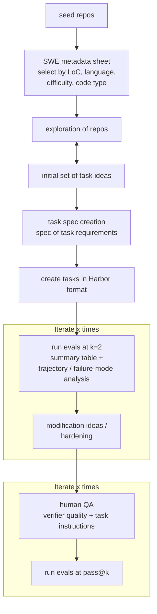

# SWE Task Generation

This repo holds the skills and source data used to turn **seed repositories** into
**hard, original SWE agent tasks** in Harbor format. It captures the
end-to-end pipeline: pick the right repos, build a deep mental model of each, ideate
task surfaces, write a per-repo spec, build the Harbor task, then iterate with evals,
hardening, and human QA until each task is genuinely hard, fair, and shippable.

The goal of every task is the **"Difficult"** band: a ~100-LoC, multi-file gold patch
(feature implementation or bug fix), deterministic offline `fail2pass` + `pass2pass`
tests, a `<100 MB` git image with an offline Docker build, and an original problem
(not derived from a public issue/PR/CVE) that frontier and OSS models solve `<50%` of
the time.

## Workflow

Each phase below maps to a step in that diagram. Phases 1–3 are automated by the
skills in this repo; phases 4–6 are described as process steps (the eval steps are
kept high-level on purpose — they run on Harbor's eval harness).

---

### Phase 1 — Select seed repos  ·  skill: [`seed-repo-selection`](skills/seed-repo-selection/)

Start from the SWE metadata sheet
(`Turing SWEBench Public Dataset (Long-Range Tasks only, n=2551).xlsx`, included here)
and select **distinct, high-quality repositories** — not the sheet's existing tasks —
to author *original* tasks from.

The skill (`skills/seed-repo-selection/scripts/select_seed_repos.py`) filters and ranks rows
against the task requirements and writes a deduped CSV (one row per repo):

- **Metadata used** (mirrors the diagram): per-task patch size (`instance_loc`),
  total repo size (`loc`), `language`, `difficulty_score`, `code_type_primary`
  (feature / bug-fix / refactor), `f2p_count` / `p2p_count`, `stars`.
- **Quality gate** (all tunable): `instance_loc` in a ~100-LoC band, `f2p_count >= 3`,
  `stars >= 250`, sane repo size (drops the unknown/huge sentinel) so the image stays
  small, and code type in {feature, bug-fix, refactor}.
- **Coverage**: pick N repos per language group (e.g. `JS/TS, Python, Java, C#`),
  with a bug-fix/feature mix preserved by the ranking score.

**Output:** `seed_repos.csv` — the candidate repos that feed exploration.

### Phase 2 — Explore repos & ideate task surfaces  ·  skill: [`seed-repo-exploration`](skills/seed-repo-exploration/)

For each selected repo, shallow-clone it and run one **read-only exploration
subagent** (in parallel batches) that returns a dense `repo_summary.md`. The summary
is task-authoring intelligence, not docs:

- overview, build/test/tooling, architecture, and a real **mental model** (type
  hierarchy, module graph, end-to-end pipeline) — every claim cites a real file path;
- **Testing** + **Offline / Containerization Notes** — which test layers are
  offline-safe (unit) vs need network/display/GPU/live services (the offline gate);
- **"Good Surfaces for Original Tasks"** — 8–14 file-cited candidate task ideas, each
  marked feature vs bug-fix and offline-safe vs not, with a ~100-LoC change sketch.

This is the **exploration ⇄ initial task ideas** loop in the diagram: the "Good
Surfaces" section *is* the initial set of task ideas, and thin or incomplete summaries
are re-explored until each repo has a solid summary plus viable surfaces.

**Output:** `tasks/<repo-slug>/repo_summary.md` per repo.

### Phase 3 — Write the task spec  ·  skill: [`task-spec-creation`](skills/task-spec-creation/)

Turn each explored repo into **one** `task_spec.md` describing the single strongest,
deliberately **hard, original** task to build from it — the "spec of task
requirements" in the diagram. This is the contract the later Harbor build is written
against.

- **Pick exactly one surface** per repo — the hardest viable one — from the repo's
  "Good Surfaces", then confirm it against the actual cloned source.
- **Prove originality** against the pinned SHA and classify the task as one of:
  net-new feature, real edge-case gap, or (last resort) seeded regression — so it is
  not derived from a public issue/PR/CVE and the gap/bug is genuinely real in the
  snapshot.
- **Confirm buildability**: a ~100-LoC multi-file gold patch is feasible, there's an
  exact correctness oracle, and deterministic offline `fail2pass` + `pass2pass` tests
  can be written.
- **Don't leak**: the problem-statement draft describes behavior only — no file
  lists, no test names, no implementation steps.

The skill ships a `difficulty_playbook.md` (levers + ranked "hard archetypes" + a
self-test for "is this actually hard?") and a `task_spec_template.md` for the exact
output shape.

**Output:** `tasks/<repo-slug>/task_spec.md` per repo (alongside `repo_summary.md`).

### Phase 4 — Build the task in Harbor format

Implement each `task_spec.md` as a complete Harbor task. A task is hard and
demanding (>1h agent runtime, high token use), and the instruction must **not**
leak the verifier. Typical layout:

- `instruction.md` — the behavior-focused, slightly underspecified problem statement;
- `task.toml` — task metadata/config;
- `environment/` — the repo snapshot at the pinned SHA (plus a seeded regression, if
  that originality pattern is used);
- `solution/` — the ~100-LoC multi-file gold patch, kept separate from the task;
- `tests/` — the verifiers: deterministic `outcome_tests`, an LLM `outcome_judge` on
  the deliverable, and an LLM `process_judge` on the trajectory, composited into a
  final reward.

**Output:** one Harbor task folder per repo.

### Phase 5 — Eval & harden  ·  *iterate ×N*

Run **Harbor evals** on each built task (a low `k`, e.g. `k=2`, is enough to get
signal) and review the results, then deepen and tighten the task. No eval commands are
documented here — the tasks are run on Harbor's eval harness.

- Produce an **eval summary table** across trials (reward, pass rate, time, tokens).
- Do **trajectory + failure-mode analysis**: segment exploration vs execution, run
  root-cause analysis on agent-attributable failures, and aggregate them into a
  ranked failure taxonomy.
- Feed that into **modification / hardening**: underspecify the instruction, force
  more exploration, and tighten the deterministic tests so leading models score low
  (target a low mean deterministic reward) while the task stays fair and solvable.

Repeat until the task is genuinely hard, realistic, and still solvable.

### Phase 6 — Human QA & pass@k  ·  *iterate ×N*

Final human-in-the-loop gate before a task ships:

- **QA by a human** on **verifier quality** (no false positives/negatives; the gold
  patch passes, plausible-but-wrong solutions fail) and **task instructions** (clear,
  non-leaking, behavior-focused, solvable).
- **Run Harbor evals at `pass@k`** to confirm the task behaves as intended at higher
  sampling.

Iterate on QA findings until the task is clean and shippable.

---

## Repository contents

| Path | What it is |
|------|------------|
| `skills/seed-repo-selection/` | Skill — select & rank seed repos from the metadata sheet into a CSV. |
| `skills/seed-repo-exploration/` | Skill — deep-explore each repo into a `repo_summary.md` with task surfaces. |
| `skills/task-spec-creation/` | Skill — pick one hard, original surface per repo and write `task_spec.md`. |
| `Turing SWEBench Public Dataset (Long-Range Tasks only, n=2551).xlsx` | Source metadata sheet that Phase 1 reads. |

Each skill is a self-contained folder with a `SKILL.md` (plus templates/briefs/scripts).
They are explicitly invoked — run them in order: **selection → exploration → spec
creation** — then continue with the Harbor build, eval/hardening, and QA phases above.
